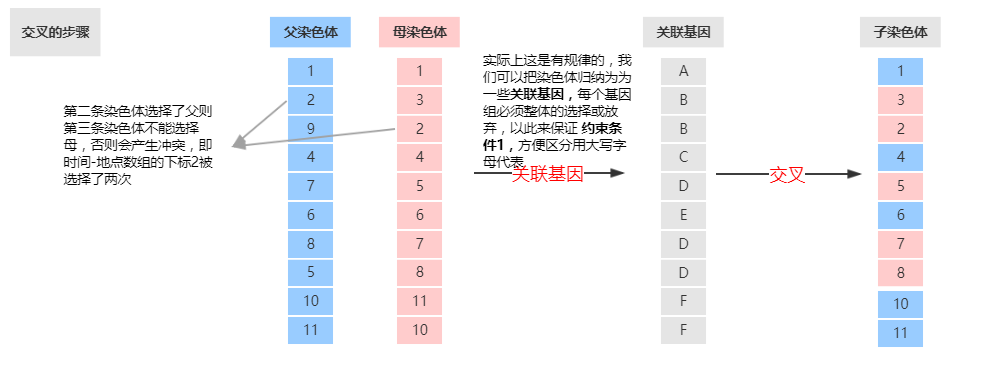
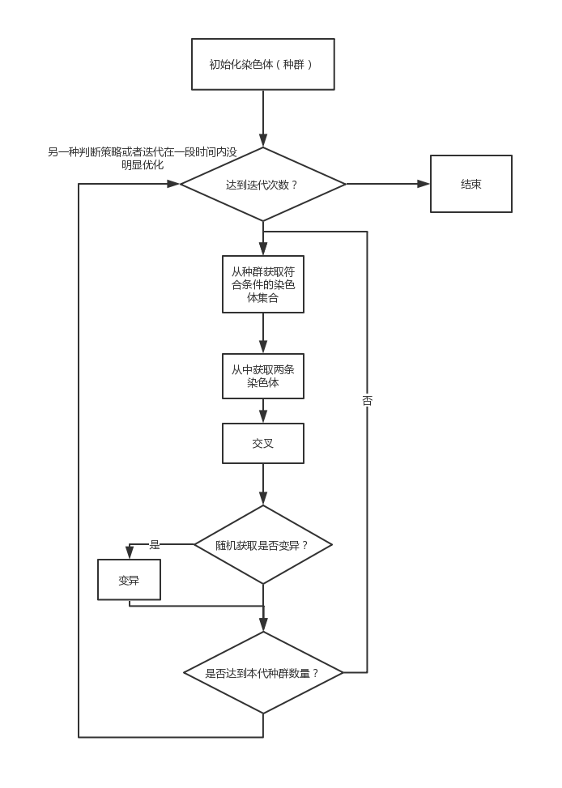

## 基于遗传算法的自动排课算法

基于我对此问题的尝试性研究，目前仅仅停留在demo阶段，提供思路，仅供参考

可以运行jsdemo目录下的html文件 来体验效果

### 模型

排课，即求课程、地点、时间三个集合的笛卡尔积
$$
\{课程\} ×\{地点\} × \{时间\} = \{排课结果\}
$$

#### 约束条件

这个结果集合需要满足排课的需要，则需满足以下约束条件：

1. 同一时间、地点不能安排多次课程
2. 参与课程的个人（学生、老师等）在同一时间不能上多门课程
3. 同一门课程在一个排课周期内的多次排课不能在同一时间
4. 尽可能满足课程所需的其他要求，如偏好的上课时间、合适的地点

#### 约束的分类

##### 硬约束和软约束

排课结果必须满足其要求才能做到最基本的可用的条件为**硬性约束**，如上述1、2、3

尽可能去满足的约束条件为 **软性约束**，如 4

##### 静态约束和动态约束

我把条件1、4定义为 **静态约束**，2、3定义为 **动态约束**，在后面的算法中要通过不同的逻辑进行处理。

这里解释下这两个约束定义：

- **静态约束**： 条件不随结果的变化而变化，如教室A星期一早上第1节只能安排唯一的课程。如课程a需要安排在早上，人数为100，则需要匹配的教室容量不小于100，选择time<=4的时段(如果定义了时段1,2,3,4为早晨)。静态约束的处理相对简单

- **动态约束** :  条件随着排课结果的变化而变化，我把它分为两种情况
  - 动态时间约束： 如星期一早上第1节安排了老师A的课程，那么老师A的其他课程均不能安排在该时段。但是如果老师A没有安排周一早上第1节课，该要求便不存在了。对于学生、同门课程的多次安排同理。

  - 动态地点约束： 于时间约束一般为排斥不同，地点约束一般为吸引。同一门课从的多次安排需要尽量安排在相同的或者相近的教室，以相同为优先，而相近的教室需要有办法来获取，把这一条约束成为动态地点约束（该部分算法在demo中未实现）

### 算法实现

下文会通过一个例子来说明问题


#### 约束的处理

##### 时间-地点数组

对于静态约束，通过结果集的模型来处理。

一天安排n节课，一个排课周期为m天，总共有s个可用教室。从0至n×m×s-1的整数，代表了所有可能的排课时间地点的组合。排课结果就是这个整数集合中的一部分，只要保证值不重复，便满足了“同一时间、地点不能安排多次课程”。通过这个值来获日期时间或者地点也非常的方便：

```javascript
const MAX_DAY = 7;
const MAX_TIME = 12;
const TIME_LEN = MAX_DAY * MAX_TIME;
// 获取结果值
let getIndex = (day,time,room)=>{
    return TIME_LEN * room + MAX_TIME*day + time;
}
// 根据 index 获取 日期 时间 教室的索引
let getPosition = (index)=>{
    var room= Math.floor(index/TIME_LEN);
    var daytime = index%TIME_LEN;
    var day = Math.floor(daytime/ MAX_TIME);
    var time = daytime%MAX_TIME;
    return {day,time,room};
}
// 获取时间索引，可用于比较是否为相同时间
let getDayTime = (index)=>{
    return index%TIME_LEN;
}
```

运行

```javascript
getIndex(1,2,3)
> 266
getPosition(266)
> {day: 1, time: 2, room: 3}
```

以上述例子中的情况为例，结果集中的每一个值应该从2×2×3= 12 即 0-11中取得并不可重复

它们代表的意思是

| 地点\时间 | 第1天第1节 | 第1天第2节 | 第2天第1节 | 第2天第2节 |
| :-------: | :--------: | :--------: | :--------: | :--------: |
|   教室1   |     0      |     1      |     2      |     3      |
|   教室2   |     4      |     5      |     6      |     7      |
|   教室3   |     8      |     9      |     10     |     11     |

我们把这个数组定义为 “**时间-地点数组**”，下文中不再赘述

##### 动态约束

我把所有运行中会改变的约束条件定义为“动态约束”，可以抽象它们的特性通过统一的方式进行处理。我们把不能安排在存在时间互斥的课程集合定义为一个**约束组**，后续的约束判断会和其相关，在后文中逐步解释。

在上述例子中，约束组是这样的，这个关系在整个排课过程中也是固定不变的，每次都可以根据这个来判断是否有冲突


实际上上面的约束关系之间还略有不同，例如同一门课从的多次安排需要尽量安排在相同的或者相近的教室，以相同为优先，而相近的教室需要有办法来获取，把这一条约束成为动态地点约束（该部分算法在demo中未实现）

为了方便后续计算，需要一个map来维护课程下标和约束组下标的关系，如果约束组按照上面图中的顺序排列，则关系为：

```json
{
    0: [0, 1, 4],
    1: [0, 4],
    2: [0, 4],
    3: [1],
    4: [2],
    5: [2],
    6: [3, 5],
    7: [3, 5],
    8: [1, 2, 6],
    9: [1, 2, 6]  
}
```


#### 染色体

每一个可行的结果集就是一条染色体

使用上述的例子，10门课的安排的结果集可能是这样的


#### 适应度

适应度代表一节课程在一个时间-地点索引上安排是否合适，这个值和硬性约束、软性约束相关，是算法参数调整的重点。

我们约定以 **值越小代表越合适**，原因是方便累加，不可用的安排可以通过函数返回一个很大的值。而越大约合适碰到不可用时要清空其适应度值为0，虽然实际上保证了后面的加权随机中完全不可取得，但是这不是个好事情，即使是完全不可用的时间我们也要让他可以以极小的概率被选择，这样，即使出现完全排不下课的情况，也可以得到一个可供参考的解而不是报错或者陷入死循环。

上述例子中,课程1-1 需要 A类型教室，人数40，按常理来说，教室1最合适，教室2浪费了容量， 教室3类型不同不可用。

约定教室类型匹配作为硬性条件（实际情况并非一定如此，在工程化中要对这些约束条件进行可配置），给一个相对很大的适应度值 例如 100，

教室容量，容量小于人数不可用，大于其容量，越接近其容量 适应度最小，可定义函数：

```java
rate = 教室容量/课程人数
if (rate<1) {
    return 100; // 容量小于人数不可用
} else if (rate<1.5) {
    return 0; // 非常合适
} else if (rate<3) {
    return 5; // 浪费容量
} else {
    return 10; // 浪费容量
}
```

##### 适应度&概率数组

各种适应度判断条件都有一个对应的适应度值函数，然后在初始化的过程中计算每节课程对应所有时间-地点的适应度数组，这个数组在整个排课算法过程中是固定的。所有 **静态约束** 的信息均在该数组中体现.

仍以上述例子做说明：

适应度数组的长度等于**时间-地点数组**

形如：

```
[12, 1000, 1005, 4, 1, 0, 0, 1, 2, 5, 1122, 1]
```

相对很大的数字一般代表着这个时段非常不可用，很可能有硬性冲突，越小的值说明该时间-地点越适合当前课程,

按概率取值时，会按照适应度数组的倒数来获取，我把它定义为 **适应度概率数组**

#### 轮盘赌随机

轮盘赌随机其实就是按照**适应度概率数组**的加权随机，即适应度越小获取的概率越高

返回数组中随机到的位置的下标，并且在下一轮随机中不会再选择到该下标（下面代码中的skip代表这个意思），保证在一个染色体生成的过程中，一个下标只能得到一次，即满足了约束条件1，并且越合适的安排被选择的概率越高。即适应度数组便是遗传算法中的“自然选择”

轮盘赌代码如下，实际上在普通的轮盘赌基础上，加入了跳过和过滤的功能

```javascript
/**
 * 带跳过的轮盘赌  经测试，轮盘赌是整个算法中耗时最多的部分，看看能否优化。
 * @param {array} weight 课程概率数组（适应度数组的倒数） (下标: 元素编号，值: 该元素对应的概率)
 * @param {array} skip 可选参数 跳过序号的集合 若skip=[1,2]则不会选择数组中下标为1,2的元素，其他值按原概率分部
 * @param {function} negativeFilter 消极过滤函数，接受参数 时空索引，
 *      返回 ture 则按照消极对待 会以极小的概率选择此值，可以认为只有没有其他任何选择时才会选中此值
 * @returns {object} 返回 {index,bad} 概率数组中某一元素的下标 及是否为较差选择
 */
function roll(weights,skip,negativeFilter) {
    var sum = 0;
    var length = weights.length;
    let badSet = new Set();
    for (var i=0; i<length; i++) {
        let weight = weights[i];
        // 当在skip数组当中 ，它的概率变为0
        if(weight == 0 ||(skip && skip.includes(i))){
            continue;
        }
        if (negativeFilter && negativeFilter(i)){
            weight = weight * 0.000001;
            badSet.add(i);
        }
        sum += weight;
    }
    var rand = Math.random() * sum;
    sum = 0;
    for (var i = 0; i<length; i++) {
        let weight = weights[i];
        // 当在skip数组当中 ，它的概率变为0
        if(weight == 0 ||(skip && skip.includes(i))){
            continue;
        }
        if (negativeFilter && negativeFilter(i)){
            weight = weight * 0.000001;
        }
        sum += weight;
        
        if (sum >= rand) {
            return i;
        }
    }
    return -1;
}
```
初始化染色体代码
```javascript
/**
 * 随机生成一组染色体 轮盘赌
 */
function generateChromosome(){

    var gene = [];
    // 从所有课程中随机取值 而不是从第一个开始 避免每次都是排在数组最开始位置的课程有最优先的选择，使种群的基因更丰富
    var randomIndex = new RandomIndex(adaptability.length); 
    var lessonIndex;
    while((lessonIndex=randomIndex.next())>=0){
        let adapt = adaptability[lessonIndex]
        // 此处获取冲突中的动态约束关联的课程已占用的时间段
        let conflictSet = conflict.relatedDayTime(lessonIndex,gene);
        // 当下表存在于冲突集合中，被过滤函数判断为"极低概率选择"
        let result =  roll(adapt,gene,roomTime => conflictSet.has(indexUtil.getDayTime(roomTime)));
        let dayTimeRoom = result;
        gene[lessonIndex] = dayTimeRoom;
    }
    // 初始化时所谓的“badSelect”即时间冲突的差选择为0（已经通过轮盘赌把选中概率降到了极低）
    var chromosome = new Chromosome(gene,0); 

    return chromosome;
}
```


#### 迭代

经过上述步骤便可获得一个初始化的基本可用的染色体，它满足了静态约束条件,对于约束1，严格满足，对于约束4 越适合的安排被选中的概率越大。**如果我们直接选择选择最大的适应度，也就无所谓遗传迭代了，如果追求快速获得一个基本可行排课结果，算法可以到此为止，它的执行效率是比较高的**，设置迭代次数为0即可。

然后便进入了遗传算法迭代的部分，目的是找出适应度的倒数尽可能最大结果。首先 初始化 n个染色体，这n个染色体（排课结果集）就是遗传算法中的“种群”，以此为基础进行迭代


##### 动态适应度

上述适应度概率数组解决了静态约束的问题，每轮迭代的交叉变异还会引入新的冲突不满足**约束条件2、3**，原先我尝试通过严格的检查来确保不会发生此情况，但是带来的问题是得到的解相对较差，效率低下。因此定义动态适应度解决动态冲突问题，上文中我们已经建立了和每节排课关联的**约束组**，从每个约束组中计算是否存在时间冲突的情况，每个冲突记为一个 **坏选择**,在计算适应度的时候，根据坏选择数量进行扣分，这样冲突较多的染色体便不再优秀。这个扣分策略目前采用简单的 数量*分数 的方式，分数可配置。

染色体代码

```javascript
/**
 *  染色体类 包括基因序列 适应度
 * @param {number[]} geneOrder 基因序列
 * @param {number} badSelect 差选择数量
 */
function Chromosome(geneOrder,badSelect){
    this.badSelect = badSelect;
    this.setGeneOrder=(geneOrder)=>{
        _setGeneOrder(geneOrder);
    }
    let _setGeneOrder = (geneOrder) => {
        this.geneOrder = geneOrder;
        this.adapt = 0;
        for (let lessonIndex = 0; lessonIndex < geneOrder.length; lessonIndex++) {
            // 此时 i 代表课程序列 val 代表时空序列
            const spaceTimeIndex = geneOrder[lessonIndex];
            this.adapt += adaptability[lessonIndex][spaceTimeIndex];
        }
        this.adapt -= badSelect *CONFIG.badSelectVal; 
    }
    _setGeneOrder(geneOrder);
}
```

##### 淘汰策略

初始化/一轮迭代 完成的染色体要检测其适应度值。并不是所有的染色体都有机会进入迭代，我们要根据一定的策略选择适应度相对大的结果，这也是算法调优的重要环节。如果每次都选择最高的结果，那么实际上会陷入局部极大值当中，难以获得尽量追求全局最优的效果。

淘汰策略目前我有有以下几种思路

1. 选取适应度相对较大的一部分（比例可配置）参与交叉变异，目前就是这种方式。

2. 使用所谓**模拟退火**的方式：即确定一个适应度的接受准则， 当适应度提高，接收该值，当适应度降低，以一定概率接收。 随着迭代的进行，这个概率会越来越小。

   一个满足要求的接收结果的概率函数：

$$
p = \begin{cases} 1  \quad if \quad (\Delta a>0) 
\\ exp(k\Delta a × t)  \quad if \quad (\Delta a<=0) \end{cases}
$$

其中k为可调节的参数，a为适应度值，t为迭代次数


##### 交叉

经过上述步骤获得的染色体集合，对他们随机选择两组进行交叉

交叉是算法的难点之一，因为染色体的生成满足了很多的约束条件，交叉会破坏这些约束条件，但是不通过这个步骤又无法获得更优的结果，总结其规律我定义了一个**关联基因**来解决问题。

这个步骤比较麻烦我画图说明：



整体流程代码如下：

```js
var childGene = [];// 以父基因为基础添加母基因来实现交叉
var set = new Set(); // 用于保存已经关联的基因
var relatedGenes = []; //关联基因的索引
// 遍历寻找关联基因
for (let i = 0; i < fatherGene.length; i++) {
    if(set.has(i))
        continue;
    let gene = motherGene[i];
    let point = fatherGene.indexOf(gene);
    let related = [i];
    // 当父基因组中存相同的基因且不是初始索引位置
    // 关联基因寻找完成的标志为：
    // 1 形成闭环  例如 [1,2,3] 和 [2,3,1]
    // 2 不再存在相同的基因  例如 [1,2,3] 和 [2,3,5]
    while (point >=0 && point!=i) { 
        gene = motherGene[point];
        set.add(point);
        related.push(point);
        point = fatherGene.indexOf(gene);
    }
    relatedGenes.push(related);
}
for (let i = 0; i < relatedGenes.length; i++) {
    let releted = relatedGenes[i];
    let fromFather = Math.random()<0.5;

    for (let j = 0; j < releted.length; j++) {
        let index = releted[j];
        childGene[index] = fromFather? fatherGene[index]: motherGene[index];
    }
}
return childGene;
```

##### 变异

变异是一个增加种群丰富程度的方式，但不能概率过高，一个较低的变异概率可以增加种群丰富程度，提高得到解的适应度，较高的变异概率会埋没掉优秀的基因，变异概率的参数也是可配置的。

```js
/**
 * 变异
 * @param {number[]} geneOrder 基因序列
 */
function vary(geneOrder){
    for (let i = 0; i < geneOrder.length; i++) {
        // CONFIG.varyRate 为变异概率，经过不断测试，我设置为了0.05
        if(Math.random()<CONFIG.varyRate){
            let adapt = adaptability[i];
            // 获得该基因对应的约束组
            let conflictSet = conflict.relatedDayTime(i,geneOrder);
            // 轮盘赌获得新的基因，通过坏选择过滤的方式让冲突基因被选择的概率降到极低
            let result = roll(adapt,geneOrder,dayTimeRoom => 	
                              conflictSet.has(indexUtil.getDayTime(dayTimeRoom)));
            if (result>=0) {
                geneOrder[i] = result;
            }
        }
    }
}
```

#### 整体流程



### 工程化

排课算法是一个相对比较复杂的，后续优化调整可能会比较频繁的内容。在对demo进行工程化的时候， 充分考虑到各种情况，要抽象其核心内容，定义好数据出入的接口，参数配置统一配置，让使用者适配该工具而不是去适配业务数据。

1. 充分遵循面向对象的编程原则，尽量实现面向接口编程，方便替换修改，尤其是在一些可能经常需要优化的地方，例如适应度函数，淘汰策略，染色体动态适应度值的扣减等。尽量使用一些类似策略模式或者模板方法模式的方式（这个说着轻巧，难度很大）
2. 充分利用java语言的特性，让整体逻辑更加清晰，暴露出简单的接口面向使用者。
3. 充分利用缓存和多线程机制，提高算法运行效率，例如同一代的多次交叉变异明显是互不相干的，可以并行计算。


